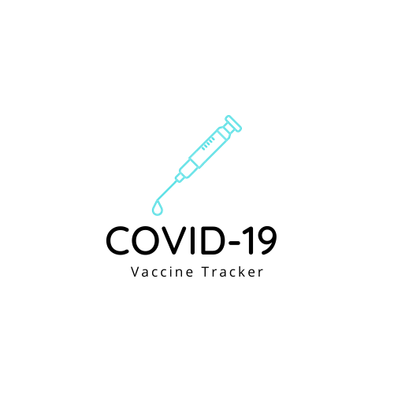

# Covid-19 Global Vaccine Tracker
<!-- PROJECT LOGO -->
 

  

  <h3 align="center">Covid-19 Global Vaccine Tracker</h3>

  

     🚀Real-time Global Vaccination Tracker
     
    <a href="https://github.com/QMSS-G5063-2022/Group_AB_Covid_Vaccination"><strong>Explore the docs »</strong></a>
     
     
    <a href="https://github.com/QMSS-G5063-2022/Group_AB_Covid_Vaccination">View Demo</a>
    ·
    <a href="https://github.com/QMSS-G5063-2022/Group_AB_Covid_Vaccination/issues">Report Bug</a>
    ·
    <a href="https://github.com/QMSS-G5063-2022/Group_AB_Covid_Vaccination/issues">Request Feature</a>
  

<!-- TABLE OF CONTENTS -->

  
Table of Contents

  <ol>
    <li><a href="#about-the-project">About The Project</a></li>
    <li><a href="#contributor">Contributor</a></li>
    <li><a href="#acknowledgements">Acknowledgements</a></li>
  </ol>

<!-- ABOUT THE PROJECT -->
## About The Project
A **global vaccine tracker** analysis how quickly countries are vaccinating their populations, using data collected from over 130 countries by the Our World in Data project at the University of Oxford.

<!-- CONTRIBUTOR -->
## Contributor

<table align="center">
  <tr>
    <td align="center"><a href="https://github.com/ashizhou"> <b>Yixiao Zhou</b></a> <a href="yz4122@columbia.edu" title="Email-Address">yz4122@columbia.edu</a></td>
      <td align="center"><a href="https://github.com/gabrici39"> <b>Ruoyi Gao</b></a> <a href="rg3324@columbia.edu" title="Email-Address">rg3324@columbia.edu</a></td>
     <td align="center"><a href="https://github.com/ZIYUEXIA"> <b>Ziyu Xia</b></a> <a href="yz4122@columbia.edu" title="Email-Address">yz4122@columbia.edu</a></td>
     <td align="center"><a href="https://github.com/ZIYUEXIA"> <b>Yi Sun</b></a> <a href="yz4122@columbia.edu" title="Email-Address">yz4122@columbia.edu</a></td>
</tr>
</table>

<!-- ACKNOWLEDGEMENTS -->
## Acknowledgements
  
* [Global Vaccinations Dataset](https://ourworldindata.org/covid-vaccinations)

